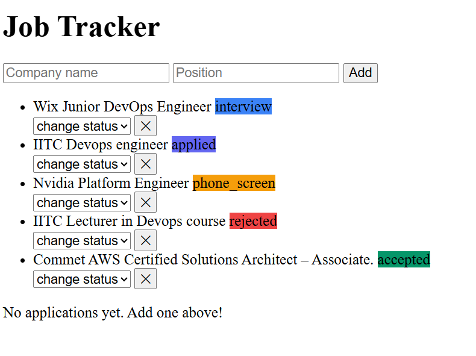
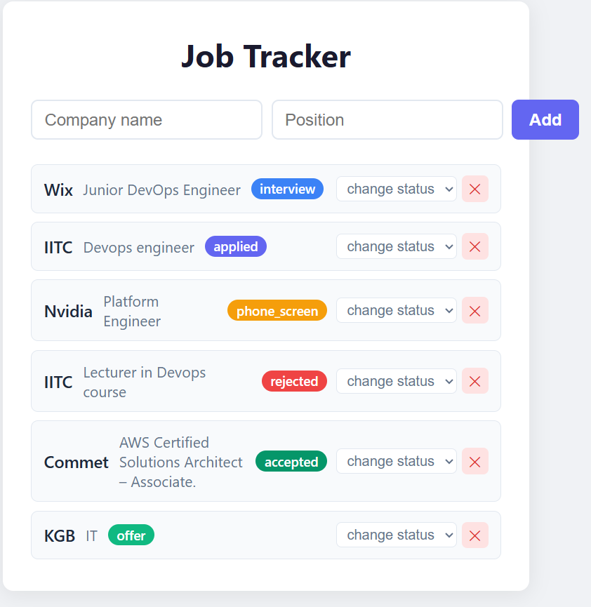
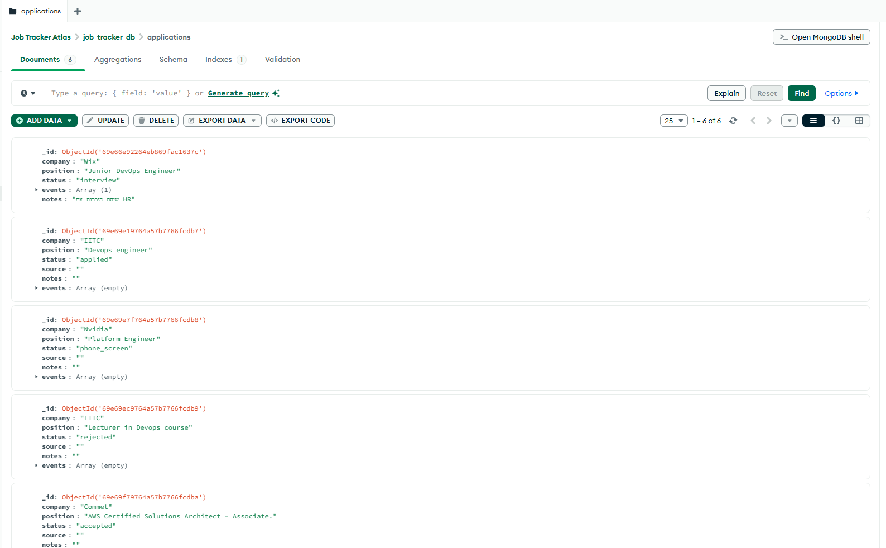

## Job Tracker API

REST API for tracking job applications, built with Flask and MongoDB.

---

## Project Structure

```
job-tracker/
 app.py                    # Entry point - registers Blueprints
 db.py                     # MongoDB connection
 errors.py                 # Global error handlers (unified JSON)
 routes/
    applications.py        # All application endpoints + events
 .env                      # MONGO_URI (gitignored)
 .env.example              # Template for .env
 requirements.txt
```

### Separation of Concerns

| File | Responsibility |
| --- | --- |
| `app.py` | Wires Blueprints, home route |
| `routes/applications.py` | HTTP layer - requests, exceptions, responses |
| `db.py` | MongoDB connection and collection access |
| `errors.py` | Catches all exceptions, returns unified JSON |

---

## Getting Started

```bash
# clone
git clone https://github.com/Dude775/job-tracker.git
cd job-tracker

# venv
python -m venv venv
source venv/Scripts/activate

# install
pip install -r requirements.txt

# run
python app.py
```

Server runs at: `http://127.0.0.1:5000`

---

## API Endpoints

| Method | Endpoint | Description |
| --- | --- | --- |
| `GET` | `/applications` | Get all applications |
| `GET` | `/applications?status=applied` | Filter by status |
| `GET` | `/applications/<id>` | Get application by ID |
| `POST` | `/applications` | Create new application |
| `PUT` | `/applications/<id>` | Update application |
| `DELETE` | `/applications/<id>` | Delete application |
| `POST` | `/applications/<id>/events` | Add event to application |

---

## Request Examples

### POST /applications

**Request:**
```json
{
    "company": "Wix",
    "position": "Junior DevOps Engineer"
}
```

**Response `201`:**
```json
{
    "_id": "69e66e92264eb869fac1637c",
    "company": "Wix",
    "position": "Junior DevOps Engineer",
    "status": "applied",
    "source": "",
    "notes": "",
    "events": []
}
```

### POST /applications/:id/events

**Request:**
```json
{
    "type": "interview",
    "note": "technical interview with team lead",
    "date": "2026-04-25"
}
```

### PUT /applications/:id

```json
{
    "status": "offer",
    "notes": "got an offer!"
}
```

### DELETE /applications/:id

**Response `200`:**
```json
{
    "message": "deleted successfuly"
}
```

---

## Error Handling

All errors return unified JSON:

```json
{
    "error": "not found",
    "message": "application 123 not found",
    "status": 404
}
```

| Code | Trigger |
| --- | --- |
| `400` | Missing fields, invalid ID, empty body |
| `404` | Application not found |
| `405` | Wrong HTTP method |
| `500` | Unexpected server error |

---

## Tech Stack
---

## Screenshots

### Before CSS


### With Styling


### MongoDB Compass


- **Python 3** + **Flask**
- **MongoDB Atlas** (PyMongo)
- **Werkzeug** HTTP exceptions
- **Postman** for API testing